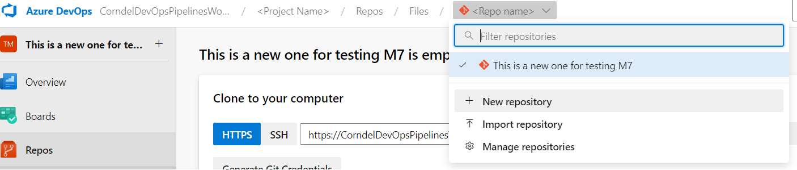
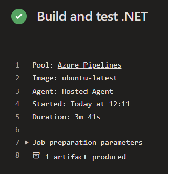

# Workshop 7 Instructions

## Part 1 (GitHub/GitLab)

Select the correct set of instructions for your platform of choice:

- [GitHub Actions](./github_actions.md)
- [GitLab CI](./gitlab.md)

## Part 2 (Azure DevOps)

### Explore Azure DevOps

> Remember that Azure DevOps is a product: despite the name, it shouldn't be seen as a silver bullet for "doing DevOps"!

You should have been provided access to an Azure account at this stage. If you do not have the details for that, please ask a trainer.

You can access the Azure Portal generally at <https://portal.azure.com/>, but for now we can skip straight through to the Azure DevOps (ADO) portal at <https://aex.dev.azure.com/>.

From here, using the Corndel Digital Academy tenant, you should see that you have been granted access to an ADO Organization & a Project within that - click to open your project.

Azure DevOps does many different things, the key tabs on the left to start with are:

* **Boards**
  * Here ADO offers various structures of ticketing-boards, used for tracking work
  * It can be offer various powerful capabilities, such as managing "sprints", "backlogs" and generating analytics.
  * If you're interested, [see Microsoft's guidance for more information](https://learn.microsoft.com/en-gb/azure/devops/boards/?view=azure-devops)
* **Pipelines**
  * The core of today's workshop, ADO offers an interface for managing pipeline jobs that can be used for a variety of tasks including Continuous Integration.
  * Pipelines can be set up using either the "Classic Interface" or a YAML file. We will encourage the use of the latter, to take advantage of codifying our pipelines
* **Repos**
  * ADO can be used as a standalone tool providing just pipelines or boards pointing at work being tracked separately, but is commonly also used to host the code itself in repositories (repos)

Take a couple of minutes to explore the different views available within your project, and familiarise yourself with the ADO interface.

### Upload a repository

Before we can create our pipelines, we need somewhere for the YAML file to be read from.

We typically want this to be stored directly alongside our codebase, so that we can manage changes between those seamlessly.

Within your breakout room you will have access to the same project, so at this point agree which approach you plan to use:
* A single repository
  * Where different people can work on different branches
* A repository each

If you are creating the first repository in this project, you can click the "Import" button to import the existing GitHub repository.

If someone has already created the a repository in your ADO project and you want to create another, then you can click on the repository list at the top (as per the image below) and click "Import Repository" to create a new one.



### Creating your first ADO pipeline

Now that we have a repository, we can start to create our first pipeline!

First we want to clone the repo:
* Make sure you've selected the correct repository first
* Then select the `Clone` button to find the repo URL (just as with GitHub)
* Clone that onto your machine as usual (e.g. `git clone <url> <folder name>`)

Open the repository in VS Code, and add a new file at the top level called `azure-pipelines.yml`.

Into that file, copy the following code:
```yml
# Here we specify what causes the pipeline to run; in this case changes to any branch
trigger:
- '*'

# Here we specify what type of machine (agent) to run on
pool:
  vmImage: 'ubuntu-latest'

# And here we specify a list of "jobs"
jobs:
  - job: firstJob
    displayName: "My first Job"
    # Each job has a sequence of steps to run
    steps:
      - script: echo "Hello World"
        displayName: Say Hello
      - task: Bash@3
        inputs:
          targetType: 'inline'
          script: echo "Hello World (again)"
```

Note that each step is defined as either a "script" or a "task".

**Scripts** specify a specific command to run, such as our `echo` command, or something more complex (including executing a script file!).

**Tasks** refer to a predefined module, typically built-in & provided by Microsoft. These can be useful for common requirements, such as installing a particular package, or interacting with the Azure platform.

[A list of Microsoft provided tasks can be viewed here.](https://learn.microsoft.com/en-us/azure/devops/pipelines/tasks/reference/?view=azure-pipelines)

Check you're working on the right branch and then commit & push this file.
> You may want to rename the pipeline after creation to avoid confusing it with other people's pipelines!

Moving to the Pipelines view in ADO, we can now register our pipeline.

To create your pipeline:
* Click "Create Pipeline"
* Select "Azure Repos Git" as your code location.
* Select your repository
* It should then locate your pipeline file, and you can click "Run"

After a few seconds, you should see a successful run! Check that it matches your repository & branch name, and then click into your pipeline & job to see the console output.

Can you see where your `echo` statements have printed their messages?

### Extending the pipeline

As before, we want our pipeline to be able to verify that our application is in a working state!

Try extending your pipeline to cover all the scenarios so that it:
1. Builds the C# code.
1. Runs the C# tests.
1. Builds the TypeScript code.
1. Runs the linter on the TypeScript code.
1. Runs the TypeScript tests.

It's up to you how exactly you do this, but consider:
* Can you install the appropriate version of DotNet and Node using [the provided tasks](https://learn.microsoft.com/en-us/azure/devops/pipelines/tasks/reference/?view=azure-pipelines)
* Do you want to use scripts or tasks for the other steps?
* Check the [list of options](https://learn.microsoft.com/en-us/azure/devops/pipelines/yaml-schema/steps-script?view=azure-pipelines) on the `script` task - are there any that we should set for any of your steps?
* Do you need the C# & TypeScript steps to run on the same agent?
  * Could we parallelise them?
  * Should we?

### Stretch

### (Stretch Goal) Publish an artifact

Sometimes we want our pipelines to produce a file - maybe a binary executable for our deployment, or some reporting. Have a go at generating an output from your CI pipeline and publishing it.

You may want to use the command below to generate the executable, and the [Publish Artifact task](https://learn.microsoft.com/en-us/azure/devops/pipelines/tasks/reference/publish-pipeline-artifact-v1?view=azure-pipelines):
```sh
# This will rely on both dotnet & npm being present on the agent 
dotnet publish -c Release -o /dist
```

Once the job is succeeding, you should be able to see a link to the artifact in the job output:



Click the link & check something sensible has been stored.


### (Stretch goal) Slack notifications

To make sure people are aware when there are issues with the build, it can be useful to send a notification at the end of the workflow.

**If you haven't already, please create your own personal slack workspace for this part of the exercise. This is free and can be set up [here](https://slack.com/create).**

Have a go at following [the Azure advice for integrating your pipeline with Slack](https://learn.microsoft.com/en-us/azure/devops/pipelines/integrations/slack?view=azure-devops).


